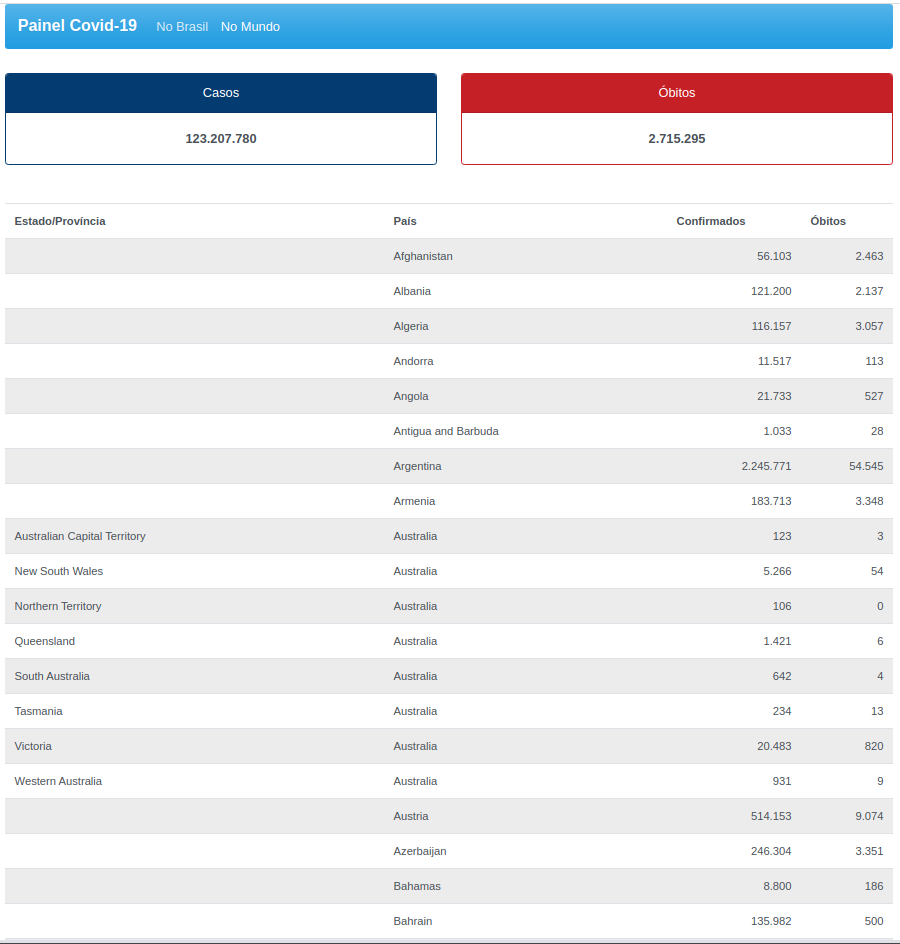
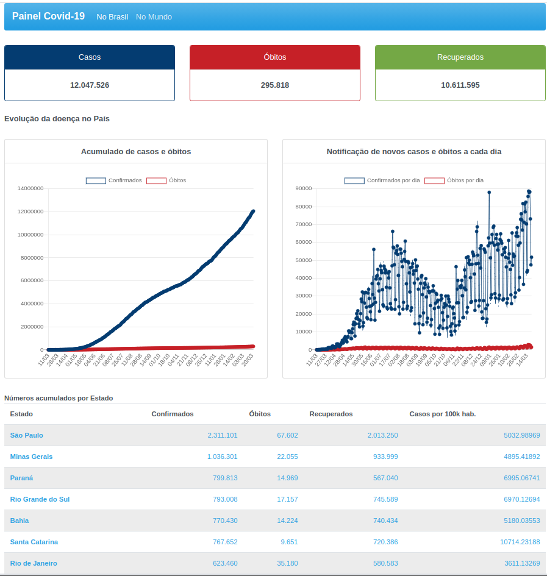

<h1 align="center">
   &#128200;  Painel Covid-19
</h1>

<h3 align="center">
    Track the numbers of Covid-19 around the world
</h3>

<p align="center">
  

  

  
  
  
    
  

  
</p>

<p align="center">
  
  [](https://coronav-tracker.herokuapp.com)

</p>

<h4 align="center"> 
	 Status: Building
</h4>

<p align="center">
 <a href="#about">About</a> •
 <a href="#live-demonstration">Live Demonstration</a> •
 <a href="#tech-stack">Tech Stack</a> • 
 <a href="#screenshots">Screenshots</a> •
 <a href="#features">Features</a> •
 <a href="#how-it-works">How it works</a> • 
 <a href="#author">Author</a> • 
 <a href="#license">License</a>

</p>


## About

Painel Covid-19 is a web application, developed with Vue.js, that helps tracking the numbers related to the Corona virus pandemic around the globe, especially the local numbers of Brazil states and cities. The data is shown using charts and tables. The application data is automatically updated by the backend each hour. The application integrates with its backend server, developed in Java with SpringBoot, that keeps the numbers being updated in an hourly basis.
The backend can be found in this <a href="https://github.com/marciorfc/springboot-coronavirus-service">repository</a>.


---

## Live Demonstration

<a alt="Painel Covid-19 Live App" title="Painel Covid-19 Live App" href="https://coronav-tracker.herokuapp.com/" target="_blank">
Painel Covid-19 - Tracker
</a>

---

## Tech Stack

The following tools were used in the construction of the project:

#### **Website**  ([Vue.js](https://vuejs.org/)  +  [JavaScript](https://developer.mozilla.org/en-US/docs/Web/JavaScript/))

-   **[Vue Router](https://router.vuejs.org/)**
-   **[Vue Chartjs](https://vue-chartjs.org/)**
-   **[Chart.js](https://github.com/chartjs/Chart.js)**   
-   **[Axios](https://github.com/axios/axios)**
-   **[BootstrapVue](https://bootstrap-vue.org/)**


> See the file  [package.json](https://github.com/marciorfc/vue-coronavirus-tracker/blob/master/package.json)

#### **Server**  ([Java](https://www.oracle.com/java/technologies/)  +  [Spring Boot](hhttps://spring.io/projects/spring-boot))

-   **[Backend Repository](https://github.com/marciorfc/springboot-coronavirus-service))**


---

## Screenshots


<p align="center" style="display: flex; align-items: flex-start; justify-content: space-between;">
  

  
</p>


---
## Features

- [x] Mundo 
   - [x] Show the total number of cases, deaths and recovered people worldwide
   - [x] List the numbers of each country sorted by their names

- [x] Brazil 
   - [x] Show the total number of cases and deaths worldwide
   - [X] Plot Line Charts:
     - [x] Accumulated numbers of new cases and deaths
     - [x] Daily numbers of new cases and deaths
     - [ ] Rolling 7-day average of cases
     - [ ] Vaccine numbers
   - [x] List the numbers of each state: cases, deaths, recovered, rate, etc.

---
## How it works


Both Frontend and Backend need to be running to work.


### Running the backend server

Look at backend repository <a href="https://github.com/marciorfc/springboot-coronavirus-service">readme file</a>

The application will open on the port 8080 
### Running the web application (Frontend)

```bash

# Clone this repository
$ git clone https://github.com/marciorfc/vue-coronavirus-tracker.git

# install the dependencies
$ npm install

# Run the application in development mode
$ npm run serve

# The application will open on the port: 8081 - go to http://localhost:8081

```

---

## Author


 
 <br />
 <sub><b>Márcio Carneiro</b></sub>
 <br />

[](https://www.linkedin.com/in/marciorfc/) 
[](mailto:mroberto@gmail.com)

---

## License

This project is under the license [MIT](./LICENSE).

Made by Marcio Carneiro 👋🏽 [Get in Touch!](Https://www.linkedin.com/in/marciorfc/)

---

